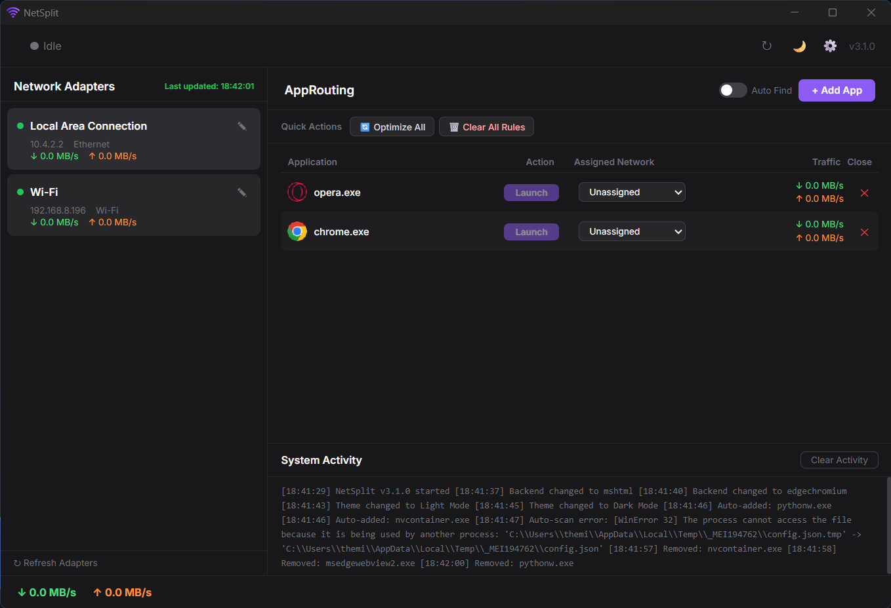
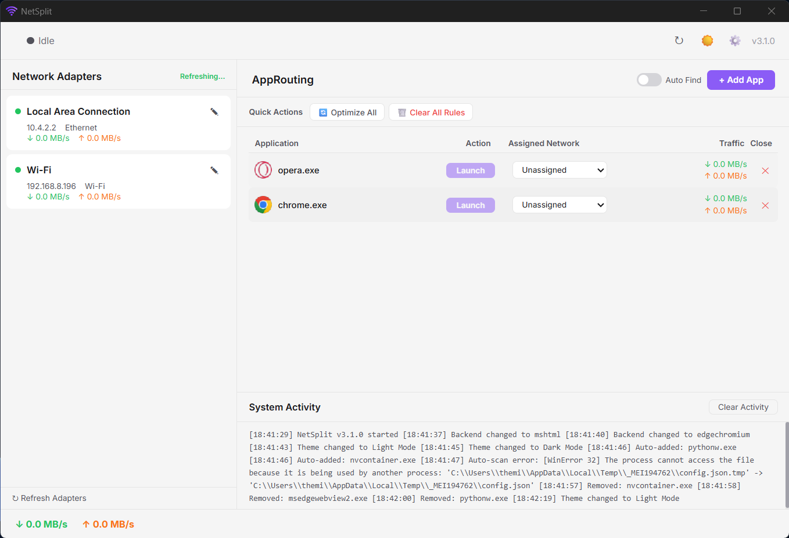

# ⚡ NetSplit

**Take full control of your network traffic.** NetSplit lets you route specific applications through specific network adapters — perfect for gamers, streamers, and power users who want to separate their traffic.

[](https://github.com/tw-santhush/NetSplit/releases)
[](https://opensource.org/licenses/MIT)
[](https://www.microsoft.com/windows)

---

## 🎯 What is NetSplit?

NetSplit is a Windows desktop application that allows you to:

- **Route specific apps** through specific network adapters (Wi-Fi, Ethernet, USB tethering)
- **Monitor network traffic** in real-time per adapter and per app
- **Optimize your network usage** by assigning the right app to the right connection

**Use Cases:**
- 🎮 **Gamers:** Route games through low-latency Wi-Fi while downloading on Ethernet
- 📡 **Streamers:** Separate streaming traffic from other downloads
- 💼 **Remote Workers:** Keep work apps on VPN while personal apps use regular internet

---

## ✨ Features

### Core Features
- 🎮 **App Routing** — Route specific `.exe` applications through specific network adapters
- 📡 **Live Network Monitor** — Real-time download/upload speeds per adapter
- 📊 **Per-App Traffic** — See download/upload speeds for each running app

### User Experience
- 🌙 **Dark & Light Themes** — Choose your preferred UI theme
- ⚙️ **Backend Toggle** — Switch between Edge Chromium (modern UI) and MSHTML (fast startup)
- 🖥️ **System Tray** — Minimize to tray with right-click menu for quick access
- 🔍 **Smart Auto Find Apps** — Automatically detects internet-using applications

### Power Features
- 📦 **Quick Actions** — Optimize All, Clear All Rules, Refresh Adapters
- 🔄 **Auto-Refresh Adapters** — Updates adapter list every 5 seconds
- 📝 **System Activity Log** — Track all actions and events with timestamps
- ⚙️ **Custom Adapter Nicknames** — Rename adapters for easy identification

### Performance & Stability
- 🚀 **Fast Startup** — Loads instantly with MSHTML backend, modern UI with Edge
- 🛡️ **Concurrent Routing Protection** — Prevents route conflicts
- 🔒 **Secure** — No command injection vulnerabilities
- 💾 **Atomic Config Saves** — Prevents corruption

---

## 📸 Screenshots

| Dark Theme | Light Theme |
|------------|-------------|
|  |  |

*Settings dialog allows you to switch between Edge and MSHTML backends and toggle themes.*

---

## 📦 Download

Download the latest installer from the **[Releases](https://github.com/tw-santhush/NetSplit/releases)** page.

| File | Description |
|------|-------------|
| `NetSplit_Setup.exe` | Full installer (recommended) |
| Source code (ZIP) | Source code archive |

---

## 🛠️ System Requirements

| Requirement | Details |
|-------------|---------|
| **OS** | Windows 10 or Windows 11 (64-bit) |
| **Privileges** | Administrator (required for routing) |
| **Runtime** | Edge WebView2 (auto-installed if missing) |
| **Disk Space** | ~200 MB |

---

## 🚀 Quick Start

1. **Download** `NetSplit_Setup.exe` from the [Releases](https://github.com/tw-santhush/NetSplit/releases) page.
2. **Run** the installer (right-click → "Run as administrator").
3. **Launch** NetSplit from the Start Menu or Desktop shortcut.
4. **Add** an application (e.g., `chrome.exe`) using the "Add App" button.
5. **Assign** it to a network adapter using the dropdown.
6. **Click Launch** and watch the traffic flow!

---

## 🧑‍💻 Build from Source

### Prerequisites
- Python 3.10 or higher
- Git
- Inno Setup (for building installer)

### Steps

```bash
# Clone the repository
git clone https://github.com/tw-santhush/NetSplit.git
cd NetSplit

# Install dependencies
pip install -r requirements.txt

# Run the app
python main.py
```

### Build the Installer

```bash
# Build with PyInstaller
pyinstaller NetSplit.spec

# Build the installer (requires Inno Setup)
"C:\Program Files (x86)\Inno Setup 6\ISCC.exe" installer.iss
```

---

## 🐛 Troubleshooting

### App starts in system tray instead of desktop
- Click the tray icon to restore the window.
- This is by design — minimize to tray for background operation.

### "Main window failed to start" error
- **Solution:** Toggle to **MSHTML** backend in Settings → Backend.
- Or install WebView2 Runtime manually from Microsoft.

### Apps not routing through the correct adapter
- Ensure you're running **as Administrator**.
- Check that the app is assigned to the correct adapter.
- Verify the adapter is connected and has internet access.

### IDM shows admin warning
- This is a known limitation of ForceBindIP. IDM detects admin mode and shows a warning. Close the warning and IDM will still work.

---

## 🤝 Contributing

Contributions are welcome! Here's how you can help:

1. **Fork** the repository.
2. **Create** a feature branch (`git checkout -b feature/amazing-feature`).
3. **Commit** your changes (`git commit -m 'Add amazing feature'`).
4. **Push** to the branch (`git push origin feature/amazing-feature`).
5. **Open** a Pull Request.

Please read our [Contributing Guidelines](CONTRIBUTING.md) before submitting.

---

## 📄 License

This project is licensed under the MIT License — see the [LICENSE](LICENSE) file for details.

---

## 🙏 Acknowledgments

- [pywebview](https://github.com/r0x0r/pywebview) — WebView2/GTK/WebKit GUI framework
- [psutil](https://github.com/giampaolo/psutil) — Cross-platform system monitoring
- [ForceBindIP](https://r1ch.net/projects/forcebindip/) — Forced application binding
- [Inno Setup](https://jrsoftware.org/isinfo.php) — Installer creation

---

## 📊 Version History

| Version | Date | Changes |
|---------|------|---------|
| **v3.2.0** | July 2026 | Stable release — backend toggle, theme support, all bugs fixed |
| v3.1.1 | July 2026 | Route command syntax fix |
| v3.1.0 | July 2026 | 24+ bug fixes, performance improvements |
| v3.0.0 | July 2026 | Complete rewrite with modern UI |

---

## 📬 Contact

- **Issues:** [GitHub Issues](https://github.com/tw-santhush/NetSplit/issues)
- **Discussions:** [GitHub Discussions](https://github.com/tw-santhush/NetSplit/discussions)

---

Built with ❤️ by tw-santhush
